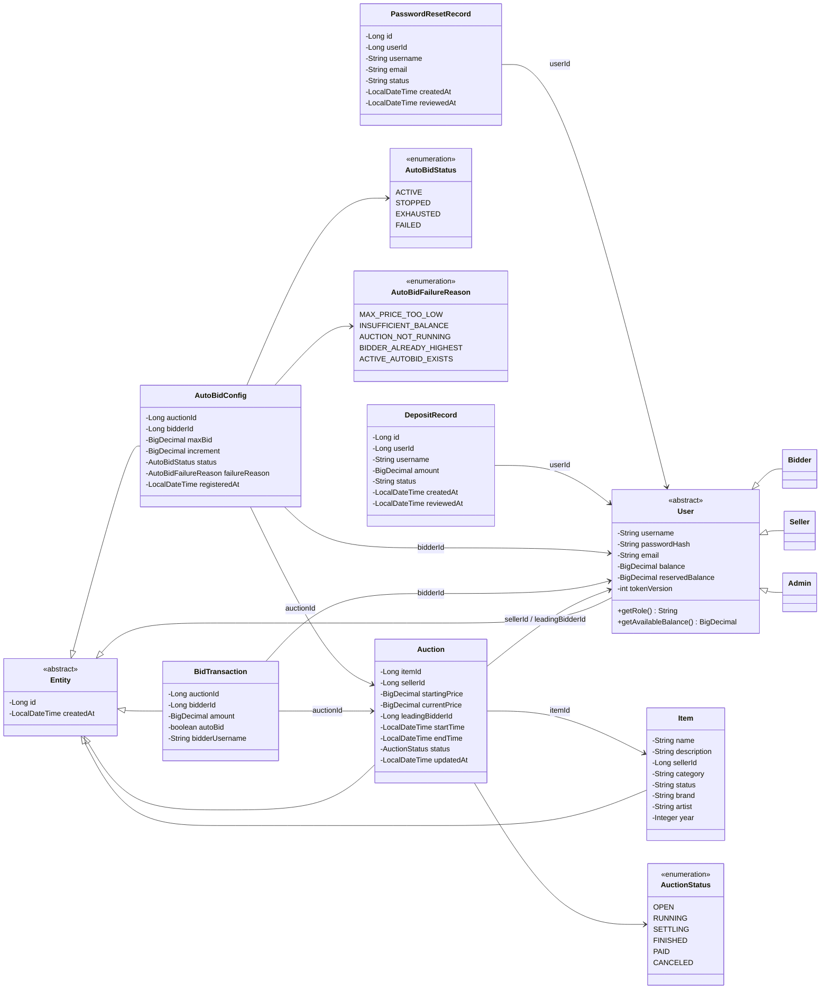
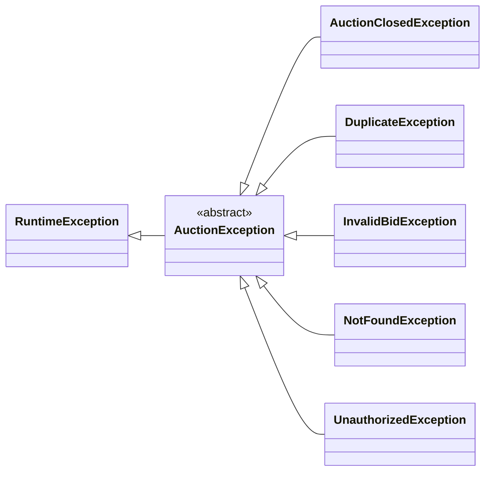

<div align="center">


# Online Auction System

*A JavaFX desktop auction client backed by a Javalin REST/WebSocket server and PostgreSQL persistence.*

[](https://github.com/kieran-labs/oop-course-project-uet/actions/workflows/ci.yml)
[](https://adoptium.net/)
[](https://openjfx.io/)
[](https://javalin.io/)
[](https://gradle.org/)

</div>

---

## 🧩 Overview

**Online Auction System** is a full-stack Java desktop application for managing auction items, sessions, bids, wallet balances, deposits, password resets, and admin moderation.

The project has two runtime parts:

- **JavaFX client**: 12 FXML screens under `src/main/resources/ui/fxml`, controlled by `src/main/java/com/auction/ui/controller`.
- **Javalin server**: REST API + WebSocket endpoints registered from `App.java`, backed by PostgreSQL through JDBI, HikariCP, and Flyway migrations.

Local runs use **Embedded PostgreSQL** by default, storing data under `data/postgres`. Tests and CI can use an external PostgreSQL database through `DB_URL`, `DB_USER`, and `DB_PASSWORD`.

Key implementation points:

- Role-based access control for **Admin**, **Seller**, and **Bidder**.
- JWT authentication with `JWT_SECRET` required at server startup.
- BCrypt password hashing with token-version invalidation after password changes.
- Item management with a flattened `Item` model and category-specific fields (`brand`, `artist`, `year`).
- Auction lifecycle: `OPEN → RUNNING → SETTLING → FINISHED / PAID / CANCELED`.
- Concurrent bid safety through PostgreSQL row locking with `SELECT ... FOR UPDATE` inside JDBI transactions.
- Wallet balance and reserved-balance handling with an append-only `wallet_transactions` ledger.
- Real-time auction and user notifications over WebSocket.
- Auto-bidding with `maxBid`, `increment`, status tracking, and failure reasons.
- Anti-sniping extension: bids near the deadline extend the auction end time.

Current verified scale:

- **99** main Java files.
- **28** test files.
- **12** JavaFX/FXML screens.
- **17** database migrations.

---

## 🖼️ Screenshots

| Login | Auction List |
|:---:|:---:|
|  |  |

| Auction Detail | Admin Panel |
|:---:|:---:|
|  |  |

---

## ✅ Implemented Features

### Core application features

- [x] Register and log in as `BIDDER` or `SELLER`.
- [x] Default admin account creation on first server startup.
- [x] JWT-protected API routes with role checks.
- [x] Change password with old-password verification.
- [x] Submit admin-reviewed password reset requests.
- [x] Admin approval creates a random temporary password of 6 lowercase letters/digits.
- [x] Seller item CRUD with category-specific detail mapping.
- [x] Seller auction creation and editing while the auction is still `OPEN`.
- [x] Auction state transitions driven by `AuctionScheduler`.
- [x] Manual bidding for bidders only.
- [x] Auto-bid configuration, stop/delete action, and status tracking.
- [x] Anti-sniping extension when a bid lands near the deadline.
- [x] Bid history persistence and bid history chart rendering in the JavaFX detail screen.
- [x] Deposit request workflow: bidder submits, admin approves/rejects.
- [x] Wallet ledger for deposit, bid freeze, release, win consume, seller payout, and cancel release events.
- [x] Notification feed with read/mark-all-read endpoints.
- [x] Admin panel for auctions, users, deposits, and password reset requests.
- [x] Admin hard-delete endpoint for auctions.
- [x] Real-time auction updates via `/ws/auction/{id}`.
- [x] Real-time user notifications/balance updates via `/ws/user/{id}`.

### Engineering features

- [x] Gradle Kotlin DSL build.
- [x] Java 21 toolchain.
- [x] JavaFX 21 modules: `javafx.controls`, `javafx.fxml`, `javafx.web`.
- [x] JUnit 5 and Mockito test suite.
- [x] Flyway database migrations.
- [x] Checkstyle, Spotless, SpotBugs, and JaCoCo integration.
- [x] GitHub Actions workflow for formatting, tests, checks, and coverage artifact upload.
- [x] Shadow JAR tasks for server and client packaging.
- [x] Windows helper scripts for server start/stop/status and database reset.

---

# Class Diagram — Current Implementation

## 1. Domain Model



> Note: `Item` is currently a single flattened class. There are no concrete `Electronics`, `Art`, or `Vehicle` subclasses in the current source tree.

---

## 2. Exception Hierarchy



`App.java` maps domain exceptions to HTTP error responses:

| Exception | HTTP status |
|---|---:|
| `IllegalArgumentException` | 400 |
| `InvalidBidException` | 400 |
| `AuctionClosedException` | 400 |
| `UnauthorizedException` | 401 |
| `NotFoundException` | 404 |
| `IllegalStateException` | 409 |
| `DuplicateException` | 409 |
| fallback `Exception` | 500 |

---

## 🏗️ Architecture

```mermaid
graph TB
    subgraph CLIENT["JavaFX Client"]
        FXML["FXML views\n12 screens"]
        UIC["ui/controller\nJavaFX controllers"]
        SCENE["SceneManager\nNavigation + session token"]
        REST["RestClient\nHTTP + JSON + Bearer JWT"]
        WSC["WebSocketClient\nAuction/user WS + reconnect"]
        UTIL["NotificationStore\nBackgroundBidWatcher\nUserBalanceWatcher"]
        FXML <--> UIC
        UIC --> SCENE
        UIC --> REST
        UIC --> WSC
        UIC --> UTIL
    end

    REST -->|HTTP JSON| MW["JwtMiddleware"]
    WSC <-->|/ws/auction/{id}\n/ws/user/{id}| WSH["AuctionWebSocketHandler"]

    subgraph SERVER["Javalin Server"]
        MW --> CTRL["Controllers\nAuth · Item · Auction · Bid · Notification"]
        CTRL --> SVC["Services\nUser · Item · Auction · Bid · Notification · PasswordReset"]
        SCHED["AuctionScheduler\n5-second scan"] --> SVC
        SVC --> DAO["DAO layer\nJDBI + SQL"]
        SVC --> OBS["AuctionEventManager"]
        OBS --> WSO["WebSocketObserver"]
        WSO --> WSH
    end

    DAO --> DB[("PostgreSQL\nEmbedded local / external in CI")]
    DB --> FLYWAY["Flyway migrations\nV1-V17"]
```

---

## 🔄 Data Flow — Manual Bid

Scenario: a bidder places a manual bid from the auction detail screen.

```text
AuctionDetailController
  → RestClient.post("/api/auctions/{id}/bid", { amount })
  → JwtMiddleware verifies Bearer token and attaches userId/role
  → BidController checks role == BIDDER
  → BidService.placeBid(...)
      → validate positive integer VND
      → open JDBI transaction
      → AuctionDao.findByIdForUpdate(...) locks the auction row
      → State pattern validates that the auction is RUNNING
      → balance/reserved-balance checks and updates
      → anti-sniping extension if the remaining time is below threshold
      → insert BidTransaction
      → run auto-bid chain if needed
      → commit
  → post-commit WebSocket events are broadcast
  → JavaFX client updates price, chart, countdown, notifications
```

---

## 🧠 Design Patterns

### 1. State — Auction lifecycle

Implemented under `src/main/java/com/auction/pattern/state`.

```text
AuctionState
├── OpenState
├── RunningState
├── SettlingState
├── FinishedState
├── PaidState
└── CanceledState
```

`AuctionService.getState()` delegates behavior based on `AuctionStatus`. The scheduler moves auctions through time-based transitions and settlement.

### 2. Observer — Real-time auction events

Implemented by:

- `AuctionEventListener`
- `AuctionEventManager`
- `WebSocketObserver`
- `AuctionWebSocketHandler`

Bid updates, time extensions, and auction-ended events are pushed to connected clients.

### 3. Strategy — Auto-bid chain execution

`AutoBidStrategy` owns the auto-bid chain logic. It works inside the same transaction opened by `BidService`, using an executor callback so bid persistence and balance updates remain centralized.

### 4. Factory — User and state object creation

Current factory classes:

- `UserFactory`: creates `Bidder`, `Seller`, or `Admin` from a role string.
- `AuctionStateFactory`: resolves an `AuctionState` from a status string.

There is no current `ItemFactory` class in the source tree.

### 5. DAO — SQL isolation

Each persistence area has a dedicated DAO class using JDBI. `AuctionDao` exposes row-locking helpers used by bid and settlement flows.

---

## 📡 API Reference

### REST endpoints

| Method | Path | Auth | Role / Notes |
|---|---|---|---|
| `GET` | `/api/health` | Public | Server health |
| `POST` | `/api/auth/register` | Public | Register `BIDDER` or `SELLER` |
| `POST` | `/api/auth/login` | Public | Login and receive JWT |
| `POST` | `/api/auth/forgot-password` | Public | Create password reset request |
| `GET` | `/api/items` | Optional for GET | Supports seller filtering from client via query string |
| `GET` | `/api/items/{id}` | Optional for GET | Item detail |
| `POST` | `/api/items` | Required | `SELLER` |
| `PUT` | `/api/items/{id}` | Required | Owning `SELLER` |
| `DELETE` | `/api/items/{id}` | Required | Owning `SELLER` or `ADMIN` |
| `GET` | `/api/auctions` | Optional for GET | Supports status/page/size query params |
| `GET` | `/api/auctions/{id}` | Optional for GET | Enriched auction detail |
| `POST` | `/api/auctions` | Required | `SELLER` |
| `PUT` | `/api/auctions/{id}` | Required | Owning `SELLER`, `OPEN` auctions only |
| `DELETE` | `/api/auctions/{id}` | Required | Seller/admin soft cancel rules |
| `DELETE` | `/api/admin/auctions/{id}` | Required | `ADMIN`, hard delete |
| `POST` | `/api/auctions/{id}/bid` | Required | `BIDDER` only |
| `GET` | `/api/auctions/{id}/bids` | Optional for GET | Bid history |
| `GET` | `/api/auctions/{id}/auto-bid` | Required | `BIDDER` only |
| `POST` | `/api/auctions/{id}/auto-bid` | Required | `BIDDER` only |
| `DELETE` | `/api/auctions/{id}/auto-bid` | Required | `BIDDER` only |
| `GET` | `/api/users/me` | Required | Current user profile |
| `PUT` | `/api/users/me/password` | Required | Change password |
| `POST` | `/api/users/me/deposit` | Required | Submit deposit request |
| `GET` | `/api/users/me/deposit-requests` | Required | Current user's deposit history |
| `GET` | `/api/admin/users` | Required | `ADMIN` |
| `DELETE` | `/api/admin/users/{id}` | Required | `ADMIN`; self-delete blocked |
| `GET` | `/api/admin/deposit-requests` | Required | `ADMIN` |
| `POST` | `/api/admin/deposit-requests/{id}/approve` | Required | `ADMIN` |
| `POST` | `/api/admin/deposit-requests/{id}/reject` | Required | `ADMIN` |
| `GET` | `/api/admin/password-reset-requests` | Required | `ADMIN` |
| `POST` | `/api/admin/password-reset-requests/{id}/approve` | Required | `ADMIN`; returns generated temp password |
| `POST` | `/api/admin/password-reset-requests/{id}/reject` | Required | `ADMIN` |
| `GET` | `/api/notifications` | Required | Current user's recent notifications |
| `PATCH` | `/api/notifications/{id}/read` | Required | Mark one notification read |
| `PATCH` | `/api/notifications/mark-all-read` | Required | Mark all current user's notifications read |

### WebSocket endpoints

| Endpoint | Purpose | Token handling |
|---|---|---|
| `/ws/auction/{id}?token=<JWT>` | Auction bid/time/status events for one auction | Token query parameter required |
| `/ws/user/{id}?token=<JWT>` | Private user notifications and balance updates | Token userId must match path userId |

---

## Business Rules Snapshot

- `BIDDER` accounts can place manual bids and configure auto-bid.
- `SELLER` accounts create items and auction sessions.
- `ADMIN` accounts manage users, deposits, password reset requests, and auction moderation.
- Sellers cannot freely mutate auctions after they leave `OPEN` state.
- Admins and sellers follow different cancellation/deletion paths.
- Bid amounts, balances, and prices use `BigDecimal` and are validated as positive integer VND values at service/API boundaries.
- The system maintains both `balance` and `reserved_balance`; available balance is `balance - reserved_balance`.
- A leading bid freezes/reserves funds; an outbid releases the previous leader's reserved funds.
- Settlement consumes the winner's reserved funds and pays out the seller when the winner can pay.
- If no winning bidder exists, a finished auction remains `FINISHED` rather than `PAID`.
- Password reset is admin-reviewed rather than email-token based.

---

## 🤔 Technical Decisions

**Javalin over Spring Boot** — Javalin keeps the routing and request lifecycle explicit, which is useful for an educational OOP project and easier to audit than annotation-heavy DI.

**JDBI over ORM** — SQL stays visible. This matters for bid concurrency, balance reservation, settlement, and row locking.

**PostgreSQL over H2** — The project depends on PostgreSQL behavior such as `SELECT ... FOR UPDATE`. Local mode uses Embedded PostgreSQL; CI can use a PostgreSQL service.

**Database row locks over JVM-only locks** — Bid correctness is enforced at the database transaction level, not only through Java synchronization.

**Admin-reviewed reset flow** — This avoids requiring SMTP credentials for the academic/demo environment while still preventing unauthenticated direct password changes.

**Flattened item model** — `Item` stores category-specific fields directly instead of using `Electronics`, `Art`, and `Vehicle` subclasses. This matches the current database schema and simplifies persistence.

---

## ⚠️ Known Limitations

- **No real payment gateway**: money movement is represented by account balances and wallet ledger rows.
- **Local-first deployment model**: Embedded PostgreSQL is convenient for evaluation but not a production database deployment strategy.
- **Single-process WebSocket state**: auction/user WebSocket connection maps are in memory; horizontal scaling would need a shared message broker.
- **Hardcoded local client endpoint**: `RestClient` and `WebSocketClient` target `localhost:8080`.
- **Password reset has no email delivery**: admin approval returns a temporary password to admin workflow instead of sending email to the user.
- **No standalone `LICENSE` file is currently present**: add one before claiming a specific open-source license.

---

## 🚀 Getting Started

### Prerequisites

| Requirement | Version / Notes |
|---|---|
| JDK | 21+ |
| Gradle | Wrapper included; no separate Gradle install needed |
| PostgreSQL | Not required for normal local runs; Embedded PostgreSQL starts automatically |
| OS | Windows/macOS/Linux with a desktop display for JavaFX |

Check Java:

```bash
java -version
```

Expected major version: `21`.

### Configuration

`JWT_SECRET` is required before starting the server. It must be at least 32 bytes when encoded as UTF-8.

macOS/Linux:

```bash
export JWT_SECRET="replace-with-a-random-secret-of-at-least-32-bytes"
```

Windows PowerShell:

```powershell
$env:JWT_SECRET = "replace-with-a-random-secret-of-at-least-32-bytes"
```

Windows cmd.exe:

```cmd
set JWT_SECRET=replace-with-a-random-secret-of-at-least-32-bytes
```

Optional external database settings:

```text
DB_URL=jdbc:postgresql://localhost:5432/auction_test
DB_USER=auction_user
DB_PASSWORD=auction_pass
```

If `DB_URL` is not set, the server uses Embedded PostgreSQL and stores data under `data/postgres`.

### Run from source

Start the server:

```bash
./gradlew run
```

Windows:

```cmd
gradlew.bat run
```

Start the JavaFX client in another terminal:

```bash
./gradlew runClient
```

Windows:

```cmd
gradlew.bat runClient
```

### Windows helper scripts

```cmd
server-start.bat
server-status.bat
server-stop.bat
db-reset.bat
```

`server-start.bat` builds a server JAR if needed, starts it in the background, and writes logs to `logs/server.out.log` and `logs/server.err.log`.

### Build JARs

```bash
./gradlew buildJars
```

Windows:

```cmd
gradlew.bat buildJars
```

Expected generated artifacts under `build/libs/`:

```text
auction-server-1.0.0.jar
auction-client-1.0.0.jar
```

Run them in this order:

```bash
java -jar build/libs/auction-server-1.0.0.jar
java -jar build/libs/auction-client-1.0.0.jar
```

### Default account

`App.seedAdminIfNeeded()` creates the default admin account when it does not already exist:

| Role | Username | Password |
|---|---|---|
| Admin | `admin` | `123456` |

Additional bidder and seller accounts can be registered from the UI.

---

## Gradle Commands

| Command | Purpose |
|---|---|
| `./gradlew run` | Start the Javalin server from source |
| `./gradlew runClient` | Start the JavaFX client from source |
| `./gradlew buildJars` | Build server and client Shadow JARs |
| `./gradlew shadowJar` | Build the server Shadow JAR |
| `./gradlew shadowClient` | Build the client Shadow JAR |
| `./gradlew test` | Run the test suite |
| `./gradlew check` | Run quality gates, including coverage verification |
| `./gradlew spotlessCheck` | Check Java formatting |
| `./gradlew spotlessApply` | Apply Java formatting |
| `./gradlew jacocoTestReport` | Generate coverage report |
| `./gradlew spotbugsMain` | Run SpotBugs for main sources |
| `./gradlew clean` | Remove build outputs |

GitHub Actions runs formatting first, then `clean test check jacocoTestReport`.

---

## 🔑 Environment Variables

| Variable | Required | Used by | Purpose |
|---|---:|---|---|
| `JWT_SECRET` | Yes | `JwtUtil` | HMAC-256 JWT signing key; must be at least 32 UTF-8 bytes |
| `SERVER_PORT` | Documented in `.env.example` | currently fixed in `App.java` | Server code currently uses port `8080` |
| `DB_URL` | No | `DatabaseConfig` | Use external PostgreSQL instead of Embedded PostgreSQL |
| `DB_USER` | No | `DatabaseConfig` | External DB user; defaults to `postgres` |
| `DB_PASSWORD` | No | `DatabaseConfig` | External DB password; defaults to blank |

---

## 📁 Project Structure

```text
auction-system/
├── README.md
├── build.gradle.kts
├── settings.gradle.kts
├── gradlew / gradlew.bat
├── .env.example
├── .github/workflows/ci.yml
├── config/checkstyle/checkstyle.xml
├── docs/
│   ├── BUSINESS_RULES.md
│   ├── SCHEMA.md
│   └── SETUP.md
├── assets/
│   ├── app-screenshot.png
│   ├── grading-rubric.png
│   └── screenshots/
├── server-start.bat
├── server-stop.bat
├── server-status.bat
├── db-reset.bat
└── src/
    ├── main/
    │   ├── java/com/auction/
    │   │   ├── App.java                    # Javalin server entry point
    │   │   ├── ClientApp.java              # JavaFX application entry point
    │   │   ├── Launcher.java               # Fat-JAR JavaFX launcher wrapper
    │   │   ├── config/                     # DatabaseConfig, JwtUtil
    │   │   ├── controller/                 # REST/WebSocket controllers
    │   │   ├── dao/                        # JDBI persistence classes
    │   │   ├── dto/                        # API request/response DTOs
    │   │   ├── exception/                  # Domain exception hierarchy
    │   │   ├── middleware/                 # JWT middleware
    │   │   ├── model/                      # Domain models and enums
    │   │   ├── pattern/                    # factory, observer, state, strategy
    │   │   ├── service/                    # Business logic and scheduler
    │   │   ├── ui/                         # JavaFX controllers and navigation util
    │   │   └── util/                       # RestClient, WebSocketClient, notification helpers
    │   └── resources/
    │       ├── css/style.css
    │       ├── db/migration/               # Flyway V1-V17
    │       ├── fonts/                      # Lexend font files
    │       ├── icons/
    │       └── ui/fxml/                    # 12 FXML screens
    └── test/java/com/auction/              # JUnit 5 test suite
```

---

## 🧪 Testing and Quality Gates

The project includes tests for configuration, DAO behavior, services, controllers, exceptions, concurrency, notifications, wallet ledger behavior, and authorization.

Quality tooling configured in `build.gradle.kts`:

- JUnit 5
- Mockito
- JaCoCo
- Checkstyle
- Spotless with Google Java Format
- SpotBugs
- GitHub Actions

Coverage verification is currently wired into `check` with a conservative instruction coverage floor.

---

## 📄 Additional Documentation

| File | Purpose |
|---|---|
| `docs/SETUP.md` | Detailed Windows-first setup instructions |
| `docs/SCHEMA.md` | Database schema and table definitions |
| `docs/BUSINESS_RULES.md` | Business rules for bidding, wallet, settlement, notifications |
| `SECURITY.md` | Security notes and vulnerability reporting policy |
| `AUDIT_REPORT.md` | Existing project audit notes |

---

## 👥 Team

| Member | GitHub |
|---|---|
| Bui Ngoc Phu Hung | [@HumaNormal](https://github.com/HumaNormal) |
| Tran Anh Duc | [@kieran-lucas](https://github.com/kieran-lucas) |
| Nguyen Dinh Viet Duc | [@Black1206-coder](https://github.com/Black1206-coder) |
| Bui Quang Huy | [@stillqhuy](https://github.com/stillqhuy) |

---

## 📜 License

No standalone `LICENSE` file is present in the current repository snapshot. Add a license file before publishing the project under a specific license.

---

<div align="center">
<sub>Built for Advanced Programming / OOP coursework — University of Engineering and Technology, VNU Hanoi.</sub>
</div>
