<div align="center">

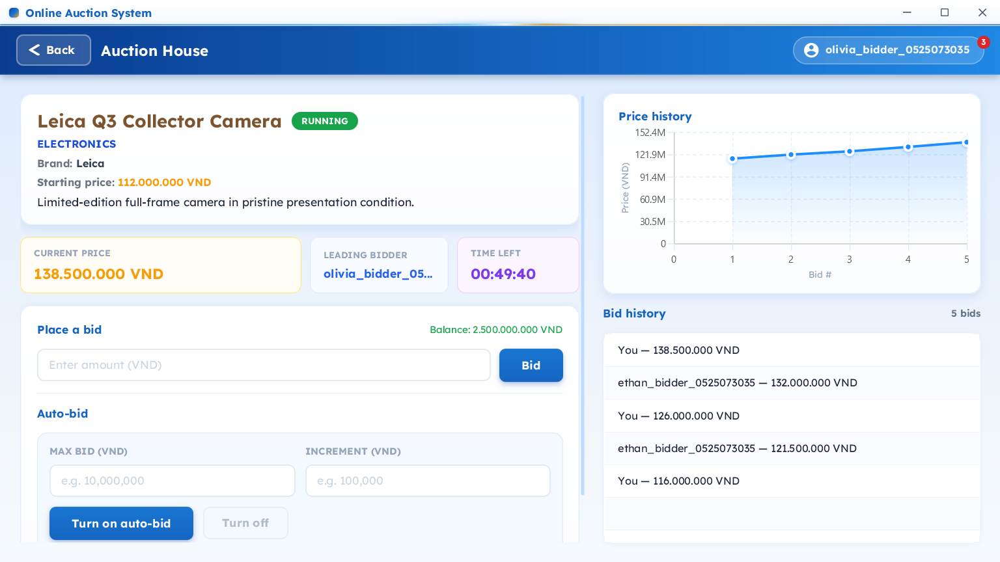

# Online Auction System

*A real-time desktop auction platform — JavaFX client · Javalin server · PostgreSQL · WebSocket*

[](https://github.com/kieran-labs/oop-course-project-uet/actions/workflows/ci.yml)
[](https://adoptium.net/)
[](https://javalin.io)
[](https://www.postgresql.org/)
[](https://gradle.org/)
[](LICENSE)

**[Download v1.0.0 JARs](https://github.com/kieran-labs/oop-course-project-uet/releases/tag/v1.0.0)** · **[Setup](docs/SETUP.md)** · **[Schema](docs/SCHEMA.md)** · **[CI](https://github.com/kieran-labs/oop-course-project-uet/actions/workflows/ci.yml)**

</div>

---

## Submission Links

> Final checklist for LTNC submission. Replace the two `TODO` links below with the final PDF/video links before submitting to the course system.

| Item | Link |
|---|---|
| GitHub repository | https://github.com/kieran-labs/oop-course-project-uet |
| Main branch | `main` |
| Prebuilt JARs | https://github.com/kieran-labs/oop-course-project-uet/releases/tag/v1.0.0 |
| Report PDF | `TODO_ADD_REPORT_PDF_LINK` |
| Demo video | `TODO_ADD_DEMO_VIDEO_LINK` |

---

## Evaluator Quick Start

### Requirements

| Requirement | Version / Note |
|---|---|
| Java | JDK **21+** |
| OS | Windows 10+ / macOS / Linux with desktop display |
| Port | `8080` must be free |
| Database | No local PostgreSQL installation required; the server starts embedded PostgreSQL automatically |

### 1. Download the release JARs

Download both files from the release page and place them in the same writable folder, for example `D:\auction-demo\`:

- `auction-server-1.0.0.jar`
- `auction-client-1.0.0.jar`

### 2. Start the server

**Windows PowerShell:**

```powershell
cd D:\auction-demo
$env:JWT_SECRET = "replace-with-a-random-secret-of-at-least-32-bytes"
java -jar auction-server-1.0.0.jar
```

**cmd.exe:**

```cmd
cd /d D:\auction-demo
set JWT_SECRET=replace-with-a-random-secret-of-at-least-32-bytes
java -jar auction-server-1.0.0.jar
```

**macOS / Linux / Git Bash:**

```bash
export JWT_SECRET="replace-with-a-random-secret-of-at-least-32-bytes"
java -jar auction-server-1.0.0.jar
```

The server is ready when Javalin logs that it has started at `http://localhost:8080`. Check it with:

```bash
curl http://localhost:8080/api/health
```

### 3. Start one or more clients

Open another terminal in the same folder:

```bash
java -jar auction-client-1.0.0.jar
```

Run the same command in multiple terminals to open multiple independent JavaFX clients for concurrent bidding and real-time update testing. Only the server needs `JWT_SECRET`; clients do not.

### 4. Default account

| Role | Username | Password |
|---|---|---|
| Admin | `admin` | `123456` |

Additional `SELLER` and `BIDDER` accounts can be created from the Register screen.

> The default admin password is for classroom/demo use. For non-demo use, set `DEFAULT_ADMIN_PASSWORD` before first startup.

---

## Overview

This project implements an online auction system with a JavaFX desktop client and a Javalin REST/WebSocket server. The server owns all database access and persists data in PostgreSQL. The default local run uses embedded PostgreSQL, while CI can use an external PostgreSQL service through `DB_URL`, `DB_USER`, and `DB_PASSWORD`.

Core capabilities:

- Role-based authentication: `ADMIN`, `SELLER`, `BIDDER`
- Seller item management: create, edit, delete items by category
- Auction lifecycle: `OPEN → RUNNING → SETTLING → FINISHED / PAID / CANCELED`
- Manual bidding with integer VND validation
- Concurrent bidding safety through PostgreSQL row-level locking (`SELECT ... FOR UPDATE`)
- Real-time bid updates through WebSocket + Observer pattern
- Auto-bidding with `maxBid`, `increment`, FIFO `PriorityQueue` ordering
- Anti-sniping: bid in final 30 seconds extends the auction by 60 seconds
- Live bid history chart in the JavaFX auction detail screen
- Unit/integration tests, Gradle quality gates, and GitHub Actions CI

---

## Screenshots

| Login | Auction List |
|:---:|:---:|
| 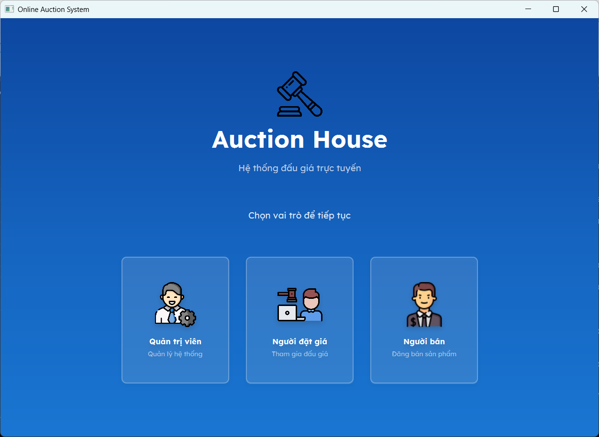 | 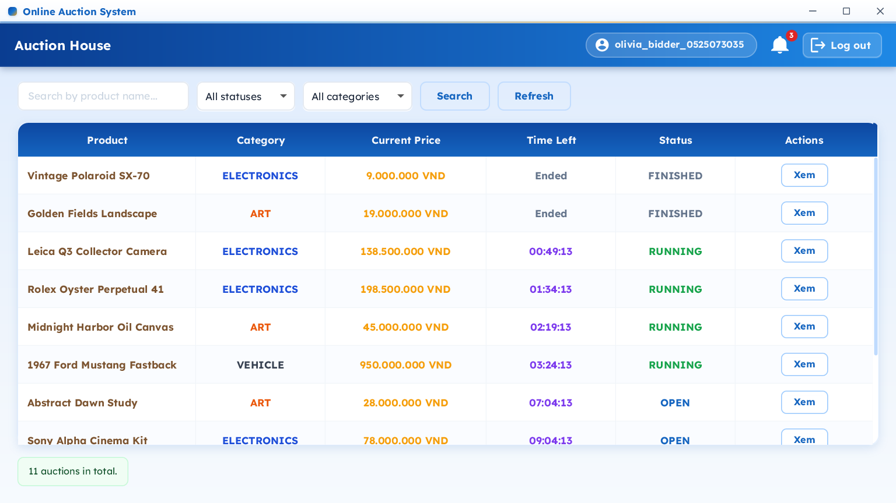 |

| Auction Detail | Admin Dashboard |
|:---:|:---:|
| 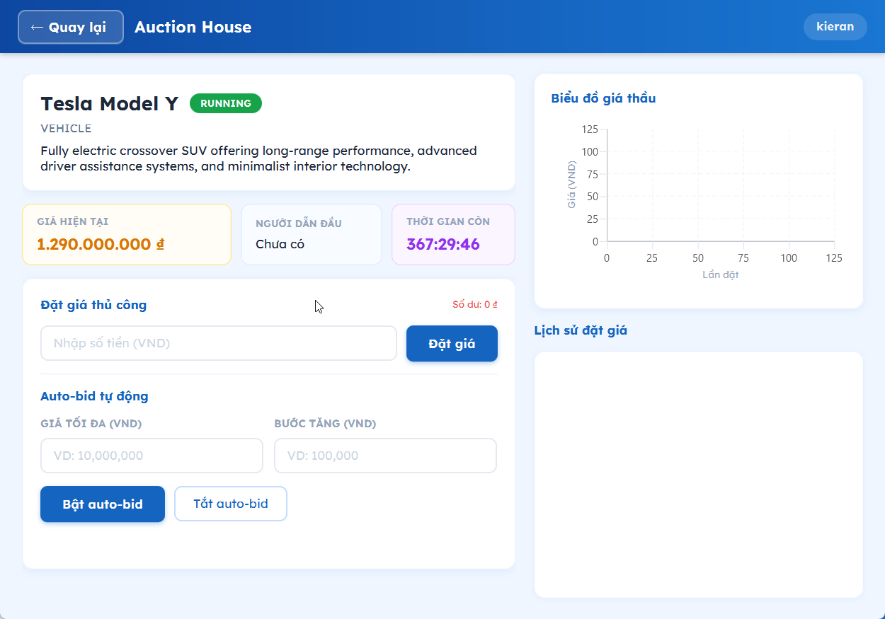 | 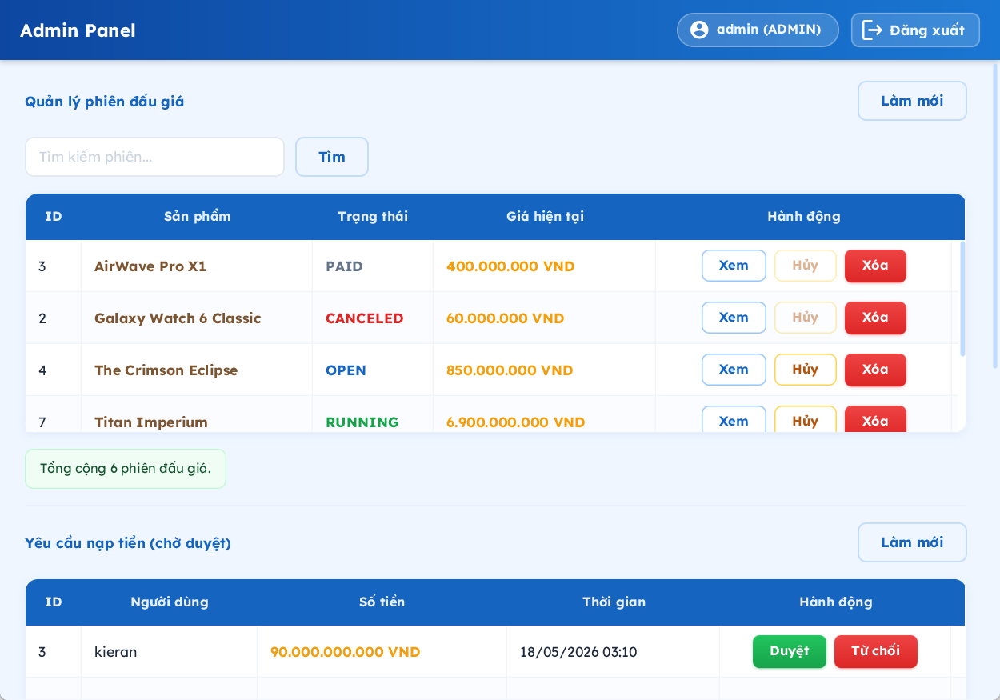 |

---

## Architecture

The application is split into a JavaFX desktop client, a Javalin server, and PostgreSQL persistence. The client never accesses the database directly; all protected operations go through JWT-secured REST endpoints or WebSocket channels managed by the server.

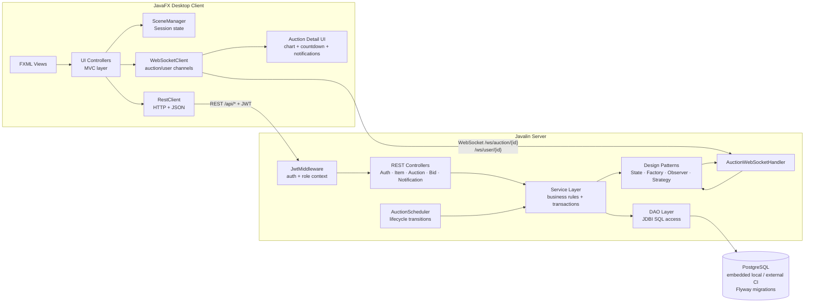

```text
JavaFX Client
  ├─ FXML views
  ├─ ui/controller        # MVC controllers
  ├─ RestClient           # REST / JSON calls
  ├─ WebSocketClient      # auction + user WebSocket channels
  └─ SceneManager         # navigation and session state

Javalin Server
  ├─ Controllers          # REST endpoints + WebSocket handler
  ├─ Middleware           # JWT verification and role context
  ├─ Services             # business logic and transactions
  ├─ Patterns             # State, Factory, Observer, Strategy
  ├─ DAOs                 # JDBI SQL access, SELECT FOR UPDATE locks
  └─ PostgreSQL           # embedded by default, Flyway migrations V1-V17
```

Important design choices:

- **Client–Server separation:** only the server accesses the database.
- **Client MVC:** JavaFX FXML views are separated from UI controllers.
- **Server layering:** Controller → Service → DAO → Database.
- **SQL-first persistence:** JDBI keeps locking and transaction behavior explicit.
- **Database-level concurrency:** bidding correctness does not depend on a single JVM lock.

---

## Class Diagrams

The diagrams are split by architecture slice and now include the key attributes and methods needed to read the system as UML, not only as a dependency graph. Getter/setter boilerplate is intentionally omitted except where it explains the model, because listing every accessor would make the README harder to evaluate and can break Mermaid rendering.

| Slice | Main files covered |
|---|---|
| Runtime composition | `App`, `AdminSeeder`, `DatabaseConfig`, `JwtUtil`, `JwtMiddleware`, controllers, services, DAOs, scheduler, WebSocket handler |
| Domain model | `Entity`, user hierarchy, item hierarchy, auctions, bids, auto-bid config, deposit/password-reset records, enums |
| API and contracts | REST controllers, request/response DTOs, error DTOs, custom exceptions |
| Persistence | JDBI DAOs, row mappers, transaction boundaries, PostgreSQL/Flyway integration |
| Design patterns | Factory, State, Observer, Strategy implementations |
| JavaFX client | `ClientApp`, `Launcher`, `SceneManager`, `Navigable`, UI controllers, REST/WebSocket/client notification utilities |

### 1. Runtime Composition and Dependency Wiring

```mermaid
classDiagram
    direction TB

    class App {
        -int SERVER_PORT
        -Path DATA_DIR
        -AtomicBoolean SHUTTING_DOWN
        +main(String[] args)
        -buildJavalin(mapper)
        -registerExceptionHandlers(app)
        -seedAdminIfNeeded(userDao)
        -stopServer(app,scheduler)
    }

    class AdminSeeder {
        -UserDao userDao
        +seed()
    }

    class DatabaseConfig {
        -HikariDataSource dataSource
        -Jdbi jdbi
        +create() Jdbi
        +shutDown()
        -runMigrations(dataSource)
    }

    class JwtUtil {
        -String SECRET
        +validateConfiguration()
        +createToken(userId,username,role,tokenVersion)
        +verifyToken(token)
    }

    class JwtMiddleware {
        -UserDao userDao
        +configure(userDao)
        +handle(ctx)
    }

    class AuctionWebSocketHandler {
        -Map connections
        -Map userConnections
        -Map observers
        -AuctionEventManager eventManager
        -ObjectMapper objectMapper
        +onConnect(ctx)
        +onUserConnect(ctx)
        +onClose(ctx)
        +onUserClose(ctx)
        +broadcast(auctionId,message)
        +pushUserNotification(userId,message)
    }

    class AuctionScheduler {
        -ScheduledExecutorService scheduler
        -AuctionDao auctionDao
        -UserDao userDao
        -ItemDao itemDao
        -AuctionEventManager eventManager
        +start()
        +stop()
        -scanAndTransition()
        -openToRunning(now)
        -runningToFinished(now)
    }

    class UserService {
        -UserDao userDao
        -DepositRequestDao depositRequestDao
        -Jdbi jdbi
        +register(req)
        +login(req)
        +findById(userId)
        +changePassword(userId,req)
        +requestDeposit(userId,amount)
        +approveDeposit(requestId)
        +delete(userId)
    }

    class AuctionService {
        -AuctionDao auctionDao
        -ItemDao itemDao
        -UserDao userDao
        -AuctionEventManager eventManager
        -Jdbi jdbi
        +getAll(status,pageRequest)
        +getById(id)
        +create(req,sellerId)
        +update(id,req,sellerId)
        +delete(id,requesterId,role)
        +hardDelete(id)
        +getState(auction)
    }

    class BidService {
        -AuctionDao auctionDao
        -BidTransactionDao bidTransactionDao
        -AutoBidConfigDao autoBidConfigDao
        -AutoBidStrategy autoBidStrategy
        -AuctionWebSocketHandler wsHandler
        +placeBid(auctionId,bidderId,amount,isAutoBid)
        +getBidHistory(auctionId)
        +createAutoBid(auctionId,bidderId,maxBid,increment)
        -executeChainBidInHandle(handle,auctionId,bidderId,amount,events)
        -notifyBidUpdate(auction,auctionId,bidderId,amount,isAutoBid)
    }

    class ItemService {
        -ItemDao itemDao
        +create(req,sellerId)
        +getAll()
        +getBySellerId(sellerId)
        +getById(id)
        +update(id,req,requesterId)
        +delete(id,requesterId,role)
    }

    class PasswordResetService {
        -UserDao userDao
        -PasswordResetRequestDao resetDao
        -Jdbi jdbi
        +requestReset(email)
        +getPendingRequests()
        +approveReset(requestId)
        +rejectReset(requestId)
    }

    class NotificationService {
        -NotificationDao notificationDao
        +getRecentNotifications(userId)
        +markRead(notificationId,userId)
        +markAllRead(userId)
    }

    class AuthController {
        +register(app,userService)
        +registerPasswordReset(app,resetService)
        -handleRegister(ctx,userService)
        -handleLogin(ctx,userService)
        -handleForgotPassword(ctx,service)
    }

    class ItemController {
        +register(app,itemService)
        -handleGetAll(ctx,itemService)
        -handleGetById(ctx,itemService)
        -handleCreate(ctx,itemService)
        -handleUpdate(ctx,itemService)
        -handleDelete(ctx,itemService)
    }

    class AuctionController {
        +register(app,auctionService)
        -handleGetAll(ctx,auctionService)
        -handleGetById(ctx,auctionService)
        -handleCreate(ctx,auctionService)
        -handleUpdate(ctx,auctionService)
        -handleDelete(ctx,auctionService)
    }

    class BidController {
        -BidService bidService
        +register(app)
        +handleManualBid(ctx)
    }

    class NotificationController {
        +register(app,notificationService)
        -handleGetNotifications(ctx,service)
        -handleMarkRead(ctx,service)
        -handleMarkAllRead(ctx,service)
    }

    class UserDao
    class ItemDao
    class AuctionDao
    class BidTransactionDao
    class AutoBidConfigDao
    class DepositRequestDao
    class PasswordResetRequestDao
    class NotificationDao
    class WalletTransactionDao
    class AutoBidStrategy
    class AuctionEventManager
    class Jdbi
    class PostgreSQL

    App --> DatabaseConfig : creates
    DatabaseConfig --> Jdbi : configures
    DatabaseConfig --> PostgreSQL : embedded/external
    App --> JwtUtil : validates secret
    App --> JwtMiddleware : configures
    App --> AdminSeeder : seeds admin
    App --> AuctionEventManager
    App --> AuctionWebSocketHandler
    App --> AutoBidStrategy
    App --> AuctionScheduler
    App --> AuthController : registers routes
    App --> ItemController : registers routes
    App --> AuctionController : registers routes
    App --> BidController : registers routes
    App --> NotificationController : registers routes

    UserService --> UserDao
    UserService --> DepositRequestDao
    PasswordResetService --> UserDao
    PasswordResetService --> PasswordResetRequestDao
    ItemService --> ItemDao
    AuctionService --> AuctionDao
    AuctionService --> ItemDao
    AuctionService --> UserDao
    AuctionService --> BidTransactionDao
    AuctionService --> AuctionEventManager
    AuctionService --> AuctionWebSocketHandler
    BidService --> AuctionDao
    BidService --> BidTransactionDao
    BidService --> AutoBidConfigDao
    BidService --> UserDao
    BidService --> AuctionService
    BidService --> AutoBidStrategy
    BidService --> AuctionEventManager
    BidService --> AuctionWebSocketHandler
    BidService ..> WalletTransactionDao
    NotificationService --> NotificationDao
    AuctionScheduler --> AuctionDao
    AuctionScheduler --> UserDao
    AuctionScheduler --> ItemDao
    AuctionScheduler --> AuctionEventManager
    AuctionScheduler --> AuctionWebSocketHandler
```

### 2. Domain Model and Core Business Objects

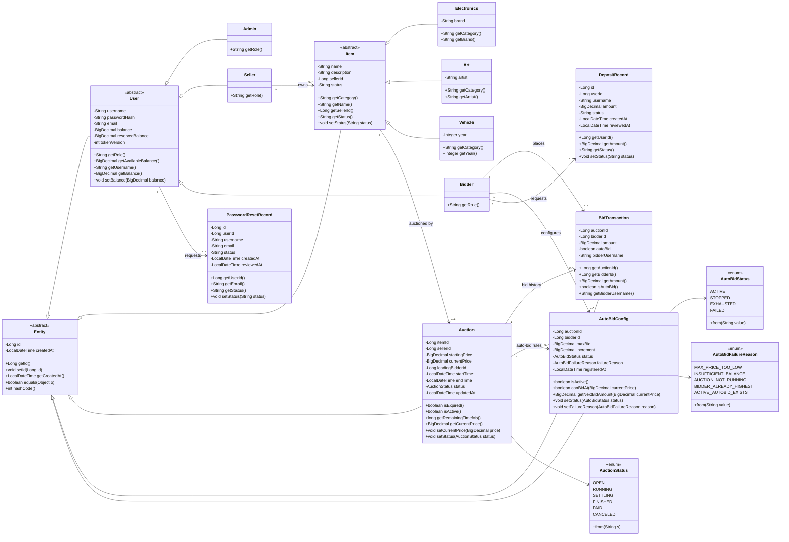

### 3. REST API, Service Layer, DTOs, and Error Contracts

```mermaid
classDiagram
    direction LR

    class AuthController {
        +register(app,userService)
        +registerPasswordReset(app,resetService)
        -handleRegister(ctx,userService)
        -handleLogin(ctx,userService)
        -handleForgotPassword(ctx,service)
    }

    class ItemController {
        +register(app,itemService)
        -handleGetAll(ctx,itemService)
        -handleCreate(ctx,itemService)
        -handleUpdate(ctx,itemService)
        -requireRole(ctx,role)
    }

    class AuctionController {
        +register(app,auctionService)
        -handleGetAll(ctx,auctionService)
        -handleGetById(ctx,auctionService)
        -handleCreate(ctx,auctionService)
        -handleUpdate(ctx,auctionService)
        -handleDelete(ctx,auctionService)
    }

    class BidController {
        -BidService bidService
        +register(app)
        +handleManualBid(ctx)
    }

    class NotificationController {
        +register(app,notificationService)
        -handleGetNotifications(ctx,service)
        -handleMarkRead(ctx,service)
        -handleMarkAllRead(ctx,service)
    }

    class UserService {
        -UserDao userDao
        -DepositRequestDao depositRequestDao
        -Jdbi jdbi
        +register(RegisterRequest req)
        +login(LoginRequest req)
        +findById(Long userId)
        +changePassword(userId,req)
        +requestDeposit(userId,amount)
        +approveDeposit(requestId)
        +rejectDeposit(requestId)
    }

    class AuctionService {
        -AuctionDao auctionDao
        -ItemDao itemDao
        -UserDao userDao
        +getAll(status,pageRequest)
        +getById(id)
        +create(req,sellerId)
        +delete(id,requesterId,role)
        +getState(auction)
        -enrichAuctionResponse(auction)
    }

    class BidService {
        -AuctionDao auctionDao
        -BidTransactionDao bidTransactionDao
        -AutoBidConfigDao autoBidConfigDao
        +placeBid(auctionId,bidderId,amount,isAutoBid)
        +getBidHistory(auctionId)
        +createAutoBid(auctionId,bidderId,maxBid,increment)
        -requirePositiveIntegerVnd(amount,label)
    }

    class LoginRequest {
        -String username
        -String password
        +getUsername()
        +getPassword()
    }

    class RegisterRequest {
        -String username
        -String email
        -String password
        -String role
        +getUsername()
        +getEmail()
        +getRole()
    }

    class CreateItemRequest {
        -String name
        -String description
        -String category
        -String categoryDetail
        +getName()
        +getCategory()
        +getCategoryDetail()
    }

    class CreateAuctionRequest {
        -Long itemId
        -BigDecimal startingPrice
        -LocalDateTime startTime
        -LocalDateTime endTime
        +getItemId()
        +getStartingPrice()
        +getStartTime()
        +getEndTime()
    }

    class BidRequest {
        -BigDecimal amount
        +getAmount()
    }

    class AutoBidRequest {
        -BigDecimal maxBid
        -BigDecimal increment
        +getMaxBid()
        +getIncrement()
    }

    class PageRequest {
        -int page
        -int size
        -int offset
        +of(page,size)
        +getLimit()
        +getOffset()
    }

    class UserResponse {
        -Long id
        -String username
        -String email
        -String role
        -BigDecimal balance
        +from(User user)
    }

    class AuctionResponse {
        -Long id
        -String itemName
        -String itemCategory
        -BigDecimal currentPrice
        -String status
        -String leadingBidderUsername
        -long remainingTimeMs
        +from(Auction auction)
    }

    class BidUpdateMessage {
        -String type
        -Long auctionId
        -BigDecimal currentPrice
        -Long leadingBidderId
        -String message
        +bidUpdate(...)
        +timeExtended(...)
        +auctionEnded(...)
    }

    class ErrorResponse {
        -String code
        -String message
        +of(code,message)
    }

    class InvalidBidException
    class AuctionClosedException
    class UnauthorizedException
    class NotFoundException
    class DuplicateException

    AuthController --> UserService
    AuthController --> PasswordResetService
    AuthController ..> LoginRequest
    AuthController ..> RegisterRequest
    ItemController --> ItemService
    ItemController ..> CreateItemRequest
    AuctionController --> AuctionService
    AuctionController ..> CreateAuctionRequest
    AuctionController ..> PageRequest
    AuctionController ..> AuctionResponse
    BidController --> BidService
    BidController ..> BidRequest
    NotificationController --> NotificationService
    UserService ..> UserResponse
    AuctionService ..> AuctionResponse
    BidService ..> BidUpdateMessage
    BidService ..> AutoBidRequest
    ErrorResponse ..> InvalidBidException
    ErrorResponse ..> AuctionClosedException
    ErrorResponse ..> UnauthorizedException
    ErrorResponse ..> NotFoundException
    ErrorResponse ..> DuplicateException
```

### 4. Persistence Layer, DAOs, and Database Mapping

```mermaid
classDiagram
    direction LR

    class DatabaseConfig {
        -HikariDataSource dataSource
        -Jdbi jdbi
        +create() Jdbi
        +shutDown()
        -startEmbeddedPostgres()
        -configureJdbi(dataSource)
        -runMigrations(dataSource)
    }

    class UserDao {
        -Jdbi jdbi
        -String SELECT_COLUMNS
        +insert(User user)
        +findById(id)
        +findByIdForUpdate(handle,id)
        +findByUsername(username)
        +findByEmail(email)
        +update(User user)
        +delete(id)
        +updateReservedBalanceInTransaction(handle,userId,amount)
        +releaseReservedBalanceInTransaction(handle,userId,amount)
    }

    class ItemDao {
        -Jdbi jdbi
        +insert(Item item)
        +findAll()
        +findById(id)
        +findByIdForUpdate(handle,id)
        +findBySellerId(sellerId)
        +update(Item item)
        +delete(id)
        +updateStatusInTransaction(handle,itemId,status)
    }

    class AuctionDao {
        -Jdbi jdbi
        +insert(Auction auction)
        +insertInTransaction(handle,auction)
        +findAll(pageRequest)
        +findById(id)
        +findByIdForUpdate(handle,id)
        +findByStatus(status,pageRequest)
        +updateInTransaction(handle,auction)
        +atomicTransition(id,from,to)
        +findDueAuctionIds(status,now)
        +findExpiredAuctionIds(status,now)
    }

    class BidTransactionDao {
        -Jdbi jdbi
        +insert(handle,tx)
        +findByAuctionId(auctionId)
        +findByBidderId(bidderId)
    }

    class AutoBidConfigDao {
        -Jdbi jdbi
        +insert(config)
        +findById(id)
        +findByAuctionAndBidder(auctionId,bidderId)
        +findActiveByAuctionId(auctionId)
        +hasActiveConfig(handle,auctionId,bidderId)
        +update(config)
    }

    class DepositRequestDao {
        -Jdbi jdbi
        +insert(record)
        +findById(id)
        +findByIdForUpdate(handle,id)
        +findByUserId(userId)
        +findByStatus(status)
        +transitionStatusInTransaction(handle,id,from,to)
    }

    class PasswordResetRequestDao {
        -Jdbi jdbi
        +insert(record)
        +findByIdForUpdate(handle,id)
        +findByStatus(status)
        +hasPendingRequest(userId)
        +transitionStatusInTransaction(handle,id,from,to)
    }

    class NotificationDao {
        -Jdbi jdbi
        +findRecentByUserId(userId)
        +markRead(notificationId,userId)
        +markAllRead(userId)
    }

    class WalletTransactionDao {
        +insert(handle,userId,auctionId,bidId,type,amount,note)
    }

    class UserMapper {
        +map(rs,ctx) User
    }

    class ItemMapper {
        +map(rs,ctx) Item
    }

    class AuctionMapper {
        +map(rs,ctx) Auction
    }

    class BidTransactionMapper {
        +map(rs,ctx) BidTransaction
    }

    class AutoBidConfigMapper {
        +map(rs,ctx) AutoBidConfig
    }

    class Jdbi
    class Flyway
    class HikariDataSource
    class PostgreSQL
    class User
    class Item
    class Auction
    class BidTransaction
    class AutoBidConfig
    class DepositRecord
    class PasswordResetRecord

    DatabaseConfig --> HikariDataSource
    DatabaseConfig --> Flyway
    DatabaseConfig --> Jdbi
    HikariDataSource --> PostgreSQL
    Flyway --> PostgreSQL
    Jdbi --> PostgreSQL

    UserDao --> Jdbi
    ItemDao --> Jdbi
    AuctionDao --> Jdbi
    BidTransactionDao --> Jdbi
    AutoBidConfigDao --> Jdbi
    DepositRequestDao --> Jdbi
    PasswordResetRequestDao --> Jdbi
    NotificationDao --> Jdbi
    WalletTransactionDao ..> Jdbi

    UserDao --> UserMapper
    ItemDao --> ItemMapper
    AuctionDao --> AuctionMapper
    BidTransactionDao --> BidTransactionMapper
    AutoBidConfigDao --> AutoBidConfigMapper
    UserMapper ..> User
    ItemMapper ..> Item
    AuctionMapper ..> Auction
    BidTransactionMapper ..> BidTransaction
    AutoBidConfigMapper ..> AutoBidConfig
    DepositRequestDao ..> DepositRecord
    PasswordResetRequestDao ..> PasswordResetRecord
```

### 5. Design Patterns and Realtime Collaboration

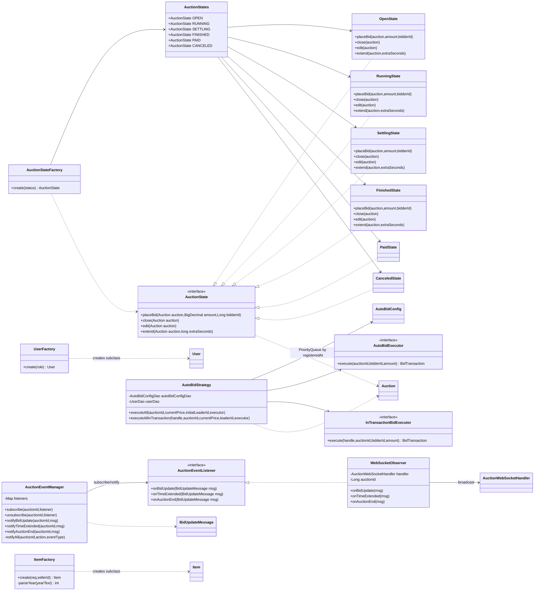

### 6. JavaFX Client, Navigation, and Realtime Utilities

```mermaid
classDiagram
    direction TB

    class Launcher {
        +main(String[] args)
    }

    class ClientApp {
        -double MIN_WIDTH
        -double MIN_HEIGHT
        +start(Stage primaryStage)
        +main(String[] args)
        -loadFonts()
    }

    class SceneManager {
        -Stage primaryStage
        -Scene scene
        -StackPane rootContainer
        -Map viewCache
        -Map controllerCache
        -Deque backStack
        -String jwtToken
        -String currentUsername
        -String currentRole
        -Long currentUserId
        +init(primaryStage,width,height)
        +getInstance()
        +navigateTo(fxml)
        +navigateTo(fxml,data)
        +navigateBack(fallbackFxml)
        +logout()
        +invalidateCache(fxml)
    }

    class Navigable {
        <<interface>>
        +onNavigatedTo()
        +onDataReceived(Object data)
        +onNavigatedFrom()
    }

    class WelcomeController {
        +goToLoginAsAdmin()
        +goToLoginAsBidder()
        +goToLoginAsSeller()
    }

    class LoginController {
        -TextField usernameField
        -PasswordField passwordField
        -String expectedRole
        +onDataReceived(data)
        +onNavigatedTo()
        +onNavigatedFrom()
        +handleLogin()
        +goToRegister()
        +goToForgotPassword()
    }

    class RegisterController {
        -TextField usernameField
        -TextField emailField
        -PasswordField passwordField
        -ComboBox roleCombo
        +onNavigatedTo()
        +handleRegister()
        +goToLogin()
    }

    class AuctionListController {
        -TableView auctionTable
        -ObservableList auctions
        -Timeline refreshTimeline
        +onNavigatedTo()
        +onNavigatedFrom()
        +handleSearch()
        +loadAuctions()
        +handleBellClick()
        +goToProfile()
    }

    class AuctionDetailController {
        -Long auctionId
        -AuctionResponse currentAuction
        -WebSocketClient webSocketClient
        -Timeline countdownTimeline
        +onDataReceived(data)
        +onNavigatedTo()
        +onNavigatedFrom()
        +handleBid()
        +handleAutoBid()
        +handleCancelAutoBid()
        +loadAuctionDetail()
    }

    class CreateItemController {
        -TextField nameField
        -TextArea descriptionField
        -ComboBox categoryCombo
        +onNavigatedTo()
        +handleCategoryChange()
        +handleCreate()
        +goBack()
    }

    class CreateAuctionController {
        -ComboBox itemCombo
        -TextField startingPriceField
        -DatePicker startDatePicker
        -DatePicker endDatePicker
        +onNavigatedTo()
        +handleCreate()
        +goToCreateItem()
        +goBack()
    }

    class ProfileController {
        -Label usernameLabel
        -Label roleLabel
        -Label profileBalanceLabel
        +onNavigatedTo()
        +onNavigatedFrom()
        +goToChangePassword()
        +goToDeposit()
        +handleLogout()
    }

    class DepositController {
        -TextField amountField
        -ListView historyList
        -Timeline depositPollTimeline
        +onNavigatedTo()
        +onNavigatedFrom()
        +handleDeposit()
        +loadBalance()
        +loadHistory()
    }

    class ChangePasswordController {
        -PasswordField currentPasswordField
        -PasswordField newPasswordField
        -PasswordField confirmPasswordField
        +onNavigatedTo()
        +handleChangePassword()
        +goBack()
    }

    class ForgotPasswordController {
        -TextField emailField
        -Button submitButton
        +onNavigatedTo()
        +handleSubmit()
        +goBack()
    }

    class AdminPanelController {
        -TableView auctionTable
        -TableView userTable
        -TableView depositTable
        -TableView passwordResetTable
        +onNavigatedTo()
        +onNavigatedFrom()
        +handleRefresh()
        +handleSearch()
        +handleRefreshDeposits()
        +handleRefreshPasswordResets()
        +handleLogout()
    }

    class RestClient {
        -String BASE_URL
        -HttpClient HTTP_CLIENT
        -ObjectMapper MAPPER
        +get(path)
        +post(path,body)
        +put(path,body)
        +patch(path,body)
        +delete(path)
        +parse(json,clazz)
        +parseList(json,clazz)
    }

    class WebSocketClient {
        -WebSocket auctionSocket
        -WebSocket userSocket
        -String currentToken
        -ScheduledExecutorService scheduler
        +connect(auctionId,jwtToken,onMessage)
        +connectUser(userId,jwtToken,onMessage)
        +disconnectAuction()
        +disconnectUser()
        +disconnectAll()
    }

    class BackgroundBidWatcher {
        -Map watchers
        +getInstance()
        +watch(auctionId,token,itemName,userId)
        +stopWatching(auctionId)
        +stopAll()
    }

    class UserBalanceWatcher {
        -WebSocketClient wsClient
        -BiConsumer onBalanceUpdate
        +getInstance()
        +connect(userId,token)
        +disconnect()
        +setOnBalanceUpdate(listener)
    }

    class NotificationStore {
        -ObservableList notifications
        -SimpleIntegerProperty unreadCount
        +getInstance()
        +add(String notification)
        +add(NotificationItem item)
        +markAllRead()
        +clear()
        +unreadCountProperty()
    }

    class NotificationItem {
        -Long id
        -String message
        -String type
        -boolean read
        -LocalDateTime createdAt
        +clientOnly(message)
        +getMessage()
        +isRead()
        +setRead(read)
    }

    Launcher --> ClientApp
    ClientApp --> SceneManager
    SceneManager --> Navigable : lifecycle callbacks
    SceneManager --> NotificationStore : badge/session cleanup
    SceneManager --> BackgroundBidWatcher : stopAll on logout
    SceneManager --> UserBalanceWatcher : disconnect on logout

    Navigable <|.. LoginController
    Navigable <|.. RegisterController
    Navigable <|.. ForgotPasswordController
    Navigable <|.. AuctionListController
    Navigable <|.. AuctionDetailController
    Navigable <|.. CreateItemController
    Navigable <|.. CreateAuctionController
    Navigable <|.. ProfileController
    Navigable <|.. DepositController
    Navigable <|.. ChangePasswordController
    Navigable <|.. AdminPanelController

    WelcomeController --> SceneManager
    LoginController --> RestClient
    LoginController --> SceneManager
    LoginController --> UserBalanceWatcher
    RegisterController --> RestClient
    RegisterController --> SceneManager
    RegisterController --> UserBalanceWatcher
    ForgotPasswordController --> RestClient
    AuctionListController --> RestClient
    AuctionListController --> NotificationStore
    AuctionDetailController --> RestClient
    AuctionDetailController --> WebSocketClient
    AuctionDetailController --> BackgroundBidWatcher
    CreateItemController --> RestClient
    CreateAuctionController --> RestClient
    ProfileController --> RestClient
    ProfileController --> UserBalanceWatcher
    ProfileController --> BackgroundBidWatcher
    DepositController --> RestClient
    ChangePasswordController --> RestClient
    AdminPanelController --> RestClient
    BackgroundBidWatcher --> WebSocketClient
    BackgroundBidWatcher --> NotificationStore
    UserBalanceWatcher --> WebSocketClient
    UserBalanceWatcher --> NotificationStore
    NotificationStore --> NotificationItem
```

---

## Main Technical Flow: Manual Bid

```text
AuctionDetailController
  → POST /api/auctions/{id}/bid with JWT
  → JwtMiddleware verifies token and role context
  → BidController requires BIDDER
  → BidService.placeBid(...)
      → jdbi.inTransaction(...)
      → auctionDao.findByIdForUpdate(...)      # SELECT FOR UPDATE
      → RunningState.placeBid(...)             # state validation
      → userDao.findByIdForUpdate(...)         # balance/reservation lock
      → release previous leader reservation
      → freeze current leader reservation
      → insert bid_transactions + wallet_transactions
      → execute auto-bid chain in the same transaction
  → after commit: Observer/WebSocket broadcasts BID_UPDATE / TIME_EXTENDED
  → all connected clients update price, countdown, and chart
```

---

## Features by Role

### Admin

- Login with seeded admin account
- View users
- Delete users when safe
- Approve/reject deposit requests
- Approve/reject password reset requests
- Delete or moderate auctions

### Seller

- Register/login as seller
- Create/edit/delete own items
- Create auctions for own available items
- View bid activity and notifications

### Bidder

- Register/login as bidder
- Submit deposit requests
- Join running auctions
- Place manual bids
- Configure/cancel auto-bid
- Receive real-time price and notification updates

---

## Build From Source

```bash
git clone https://github.com/kieran-labs/oop-course-project-uet.git
cd oop-course-project-uet
```

Set `JWT_SECRET` before starting the server:

```bash
export JWT_SECRET="replace-with-a-random-secret-of-at-least-32-bytes"
```

Windows PowerShell:

```powershell
$env:JWT_SECRET = "replace-with-a-random-secret-of-at-least-32-bytes"
```

### Run from source

```bash
./gradlew run          # server
./gradlew runClient    # client, in another terminal
```

Windows:

```cmd
gradlew.bat run
gradlew.bat runClient
```

### Build fat JARs

```bash
./gradlew clean buildJars
```

Windows:

```cmd
gradlew.bat clean buildJars
```

Generated files:

- `build/libs/auction-server-1.0.0.jar`
- `build/libs/auction-client-1.0.0.jar`

---

## Quality Gates

| Command | Purpose |
|---|---|
| `./gradlew spotlessCheck` | Verify Google Java formatting |
| `./gradlew test` | Run JUnit 5 / Mockito tests |
| `./gradlew check` | Run tests, Checkstyle, SpotBugs, and JaCoCo verification |
| `./gradlew jacocoTestReport` | Generate HTML coverage report |
| `./gradlew buildJars` | Build server and client fat JARs |

GitHub Actions runs formatting, tests, static analysis, and coverage verification on `main` pushes and pull requests.

---

## Rubric Coverage

| Rubric item | Evidence |
|---|---|
| Class design and inheritance | `Entity`, `User → Bidder/Seller/Admin`, `Item → Electronics/Art/Vehicle`, `Auction`, `BidTransaction` |
| OOP principles | Encapsulation, inheritance, polymorphism through `getRole()` / `getCategory()`, abstraction through abstract base classes and interfaces |
| Design patterns | `pattern/state`, `pattern/factory`, `pattern/observer`, `pattern/strategy`, DAO layer |
| User and product management | Auth, item CRUD, auction CRUD, role-based access |
| Auction functionality | Manual bidding, status lifecycle, settlement, winner determination |
| Error handling | Custom exception hierarchy and HTTP error mapping |
| Concurrent bidding | `BidService` transaction + `AuctionDao.findByIdForUpdate()` |
| Realtime update | `AuctionEventManager`, `WebSocketObserver`, `AuctionWebSocketHandler` |
| Client–Server | JavaFX client communicates with Javalin server through REST and WebSocket |
| MVC / layering | FXML + UI controllers; server Controller → Service → DAO |
| Build and conventions | Gradle Kotlin DSL, Checkstyle, Spotless, SpotBugs |
| Unit tests | JUnit 5 + Mockito + PostgreSQL integration tests |
| CI/CD | GitHub Actions workflow |
| Advanced: Auto-bidding | `AutoBidStrategy`, `AutoBidConfig`, `PriorityQueue` |
| Advanced: Anti-sniping | Final-30-second extension by 60 seconds |
| Advanced: Bid chart | JavaFX `AreaChart` updated from WebSocket events |

---

## Demo Flow

1. Start the server and at least three clients.
2. Log in as `admin / 123456`.
3. Register one seller and two bidders.
4. Bidders submit deposit requests.
5. Admin approves deposits and bidders receive real-time user notifications.
6. Seller creates an item and an auction.
7. Bidders open the same auction detail screen.
8. Place alternating bids and observe real-time price/chart updates.
9. Enable auto-bid for one bidder and trigger the auto-bid chain with another manual bid.
10. Place a bid near the end time to demonstrate anti-sniping extension.
11. Let the scheduler close and settle the auction.

---

## Known Limitations

- Payment is simulated through wallet balance and ledger records; there is no external payment gateway.
- Embedded PostgreSQL is intended for local evaluation and demo. Production should use managed PostgreSQL.
- WebSocket subscriptions are in-memory per server process. Horizontal scaling would require a broker such as Redis Pub/Sub.
- Password reset is admin-reviewed for classroom simplicity; production should use email or another secure out-of-band channel.

---

## Troubleshooting

### `JWT_SECRET is required and must be at least 32 bytes long`

Set the variable in the same terminal that starts the server. `.env` is not auto-loaded by the app.

### Port 8080 already in use

Stop the old server process or change the environment. On Windows, the helper scripts may help:

```cmd
server-status.bat
server-stop.bat
```

### Embedded PostgreSQL data directory is stuck

Stop the server and delete generated local state:

```cmd
rmdir /s /q data logs
```

macOS / Linux:

```bash
rm -rf data logs
```

---

## Team

| Member | GitHub | Role | Main Contributions |
|---|---|---|---|
| Bui Ngoc Phu Hung | [@HumaNormal](https://github.com/HumaNormal) | Backend Lead | Javalin server, REST controllers, WebSocket handler, DAOs, Flyway, database config |
| Tran Anh Duc | [@kieran-lucas](https://github.com/kieran-lucas) | Frontend Lead | JavaFX controllers, FXML screens, SceneManager, notifications UI, CSS theme, Lexend integration |
| Nguyen Dinh Viet Duc | [@Black1206-coder](https://github.com/Black1206-coder) | Business Logic | Services, design patterns, exception hierarchy, JWT, BCrypt authentication |
| Bui Quang Huy | [@stillqhuy](https://github.com/stillqhuy) | DevOps & QA | GitHub Actions, JUnit tests, Gradle configuration, Checkstyle, Spotless, SpotBugs, documentation |

---

## License

Released under the [MIT License](LICENSE).

<div align="center">
<sub>Built for Advanced Programming (LTNC) — University of Engineering and Technology, VNU Hanoi</sub>
</div>
