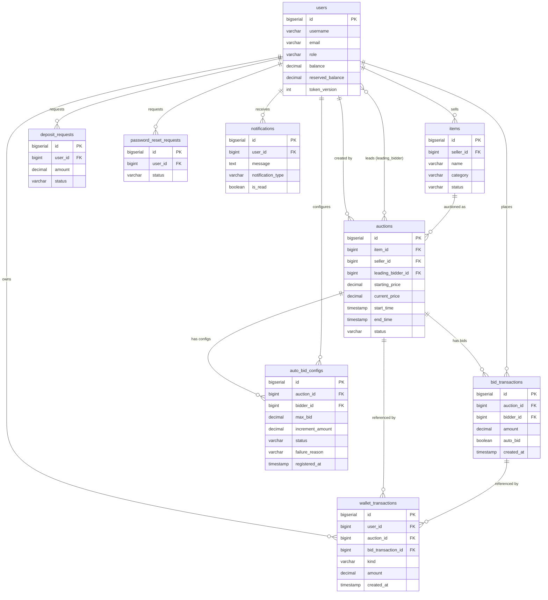

# Database Schema

## Tables Overview

| Table                    | Purpose |
|--------------------------|---------|
| `users`                  | Accounts for all roles (BIDDER / SELLER / ADMIN) |
| `items`                  | Products listed for auction |
| `auctions`               | Auction sessions |
| `bid_transactions`       | Immutable bid history |
| `auto_bid_configs`       | Per-user auto-bid configuration per auction |
| `wallet_transactions`    | Append-only balance ledger |
| `deposit_requests`       | Deposit approval workflow |
| `password_reset_requests`| Password-reset approval workflow |
| `notifications`          | Per-user notification feed |

---

## Table Definitions

### `users`

| Column             | Type            | Constraints |
|--------------------|-----------------|-------------|
| `id`               | BIGSERIAL       | PK |
| `username`         | VARCHAR(50)     | UNIQUE, NOT NULL |
| `password_hash`    | VARCHAR(255)    | NOT NULL |
| `email`            | VARCHAR(100)    | UNIQUE, NOT NULL |
| `role`             | VARCHAR(20)     | CHECK IN ('BIDDER','SELLER','ADMIN'), NOT NULL |
| `balance`          | DECIMAL(15,2)   | DEFAULT 0 |
| `reserved_balance` | DECIMAL(15,2)   | DEFAULT 0 |
| `token_version`    | INTEGER         | DEFAULT 0 — incremented to invalidate JWTs |
| `created_at`       | TIMESTAMP       | DEFAULT NOW() |

---

### `items`

| Column        | Type          | Constraints |
|---------------|---------------|-------------|
| `id`          | BIGSERIAL     | PK |
| `seller_id`   | BIGINT        | FK → `users.id`, NOT NULL |
| `name`        | VARCHAR(200)  | NOT NULL |
| `description` | TEXT          | |
| `category`    | VARCHAR(20)   | CHECK IN ('ELECTRONICS','ART','VEHICLE'), NOT NULL |
| `brand`       | VARCHAR(100)  | optional, for ELECTRONICS/VEHICLE |
| `artist`      | VARCHAR(100)  | optional, for ART |
| `year`        | INTEGER       | optional, manufacturing/creation year |
| `status`      | VARCHAR(20)   | CHECK IN ('AVAILABLE','IN_AUCTION','SOLD','REMOVED'), DEFAULT 'AVAILABLE' |
| `created_at`  | TIMESTAMP     | |
| `updated_at`  | TIMESTAMP     | |

**Indexes:** `idx_items_seller` (seller_id), `idx_items_status` (status)

---

### `auctions`

| Column               | Type          | Constraints |
|----------------------|---------------|-------------|
| `id`                 | BIGSERIAL     | PK |
| `item_id`            | BIGINT        | FK → `items.id`, NOT NULL |
| `seller_id`          | BIGINT        | FK → `users.id`, NOT NULL — denormalized for security checks |
| `starting_price`     | DECIMAL(15,2) | NOT NULL |
| `current_price`      | DECIMAL(15,2) | NOT NULL — updated on each bid |
| `leading_bidder_id`  | BIGINT        | FK → `users.id`, nullable (null = no bids yet) |
| `start_time`         | TIMESTAMP     | NOT NULL |
| `end_time`           | TIMESTAMP     | NOT NULL — extended by anti-sniping |
| `status`             | VARCHAR(20)   | CHECK IN ('OPEN','RUNNING','SETTLING','FINISHED','PAID','CANCELED'), DEFAULT 'OPEN' |
| `created_at`         | TIMESTAMP     | |
| `updated_at`         | TIMESTAMP     | |

**Indexes:** `idx_auctions_status` (status), `idx_auctions_seller` (seller_id)

---

### `bid_transactions`

| Column       | Type          | Constraints |
|--------------|---------------|-------------|
| `id`         | BIGSERIAL     | PK |
| `auction_id` | BIGINT        | FK → `auctions.id`, NOT NULL |
| `bidder_id`  | BIGINT        | FK → `users.id`, NOT NULL |
| `amount`     | DECIMAL(15,2) | NOT NULL |
| `auto_bid`   | BOOLEAN       | DEFAULT FALSE — TRUE if placed by the auto-bid system |
| `created_at` | TIMESTAMP     | DEFAULT NOW() |

Rows are **never updated or deleted** — append-only audit trail used for bid history and charts.

**Indexes:** `idx_bid_transactions_auction` (auction_id)

---

### `auto_bid_configs`

| Column             | Type          | Constraints |
|--------------------|---------------|-------------|
| `id`               | BIGSERIAL     | PK |
| `auction_id`       | BIGINT        | FK → `auctions.id`, NOT NULL |
| `bidder_id`        | BIGINT        | FK → `users.id`, NOT NULL |
| `max_bid`          | DECIMAL(15,2) | NOT NULL |
| `increment_amount` | DECIMAL(15,2) | NOT NULL |
| `status`           | VARCHAR(20)   | CHECK IN ('ACTIVE','STOPPED','EXHAUSTED','FAILED'), NOT NULL |
| `failure_reason`   | VARCHAR(50)   | CHECK IN ('MAX_PRICE_TOO_LOW','INSUFFICIENT_BALANCE','AUCTION_NOT_RUNNING','BIDDER_ALREADY_HIGHEST','ACTIVE_AUTOBID_EXISTS'), nullable |
| `active`           | BOOLEAN       | DEFAULT TRUE — legacy flag, `status` is authoritative |
| `registered_at`    | TIMESTAMP     | NOT NULL — FIFO ordering for auto-bid chain |
| `created_at`       | TIMESTAMP     | |

**Constraints:** UNIQUE(`auction_id`, `bidder_id`) — one config per user per auction

**Indexes:** `idx_auto_bid_configs_status` (status)

---

### `wallet_transactions`

| Column               | Type          | Constraints |
|----------------------|---------------|-------------|
| `id`                 | BIGSERIAL     | PK |
| `user_id`            | BIGINT        | FK → `users.id`, NOT NULL |
| `auction_id`         | BIGINT        | FK → `auctions.id`, nullable |
| `bid_transaction_id` | BIGINT        | FK → `bid_transactions.id`, nullable |
| `kind`               | VARCHAR(32)   | CHECK IN ('DEPOSIT','FREEZE','RELEASE','WIN_CONSUME','SELLER_PAYOUT','CANCEL_RELEASE'), NOT NULL |
| `amount`             | DECIMAL(15,2) | NOT NULL, CHECK > 0 |
| `reference_info`     | TEXT          | human-readable description |
| `created_at`         | TIMESTAMP     | DEFAULT NOW() |

Rows are **never updated or deleted** — append-only ledger.

**Indexes:** `idx_wallet_transactions_user_created` (user_id, created_at), `idx_wallet_transactions_auction` (auction_id), `idx_wallet_transactions_bid` (bid_transaction_id)

---

### `deposit_requests`

| Column        | Type          | Constraints |
|---------------|---------------|-------------|
| `id`          | BIGSERIAL     | PK |
| `user_id`     | BIGINT        | FK → `users.id`, NOT NULL |
| `amount`      | DECIMAL(15,2) | NOT NULL |
| `status`      | VARCHAR(20)   | CHECK IN ('PENDING','APPROVED','REJECTED'), DEFAULT 'PENDING' |
| `created_at`  | TIMESTAMP     | |
| `reviewed_at` | TIMESTAMP     | nullable — set when admin acts |

**Indexes:** `idx_deposit_requests_status` (status)

---

### `password_reset_requests`

| Column        | Type      | Constraints |
|---------------|-----------|-------------|
| `id`          | BIGSERIAL | PK |
| `user_id`     | BIGINT    | FK → `users.id`, NOT NULL |
| `status`      | VARCHAR(20) | CHECK IN ('PENDING','APPROVED','REJECTED'), DEFAULT 'PENDING' |
| `created_at`  | TIMESTAMP | |
| `reviewed_at` | TIMESTAMP | nullable |

At most one `PENDING` request per user (enforced by migration constraint).

**Indexes:** `idx_password_reset_requests_status` (status), `idx_password_reset_requests_user` (user_id)

---

### `notifications`

| Column              | Type        | Constraints |
|---------------------|-------------|-------------|
| `id`                | BIGSERIAL   | PK |
| `user_id`           | BIGINT      | FK → `users.id`, NOT NULL |
| `message`           | TEXT        | NOT NULL |
| `notification_type` | VARCHAR(50) | NOT NULL — e.g. 'OUTBID', 'AUCTION_WON', 'AUTOBID_FAILED' |
| `is_read`           | BOOLEAN     | DEFAULT FALSE |
| `created_at`        | TIMESTAMP   | DEFAULT CURRENT_TIMESTAMP |

**Indexes:** `idx_notifications_user_id` (user_id), `idx_notifications_is_read` (is_read)

---

## Entity-Relationship Diagram

