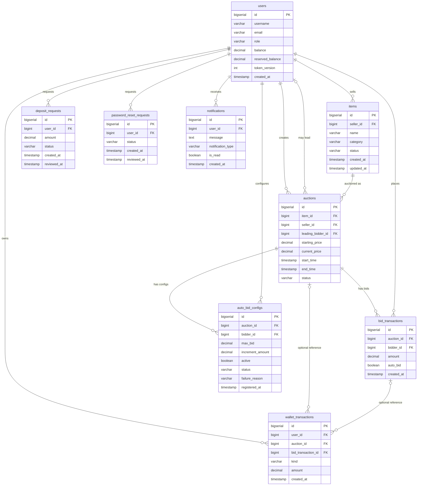

# Database Schema

This document describes the schema after applying the Flyway migrations under `src/main/resources/db/migration` (`V1` through `V17`). The default local runtime uses embedded PostgreSQL; CI or advanced users may supply an external PostgreSQL database through `DB_URL`, `DB_USER`, and `DB_PASSWORD`.

## Tables Overview

| Table | Purpose |
|---|---|
| `users` | Accounts for all roles (`BIDDER`, `SELLER`, `ADMIN`) |
| `items` | Products listed by sellers |
| `auctions` | Auction sessions |
| `bid_transactions` | Bid history for manual and auto bids |
| `auto_bid_configs` | One auto-bid configuration per bidder per auction |
| `wallet_transactions` | Wallet ledger for balance and reserved-balance movements |
| `deposit_requests` | Admin-reviewed deposit workflow |
| `password_reset_requests` | Admin-reviewed password-reset workflow |
| `notifications` | Per-user notification feed |

---

## Table Definitions

### `users`

| Column | Type | Constraints |
|---|---|---|
| `id` | BIGSERIAL | PK |
| `username` | VARCHAR(50) | UNIQUE, NOT NULL |
| `password_hash` | VARCHAR(255) | NOT NULL |
| `email` | VARCHAR(100) | UNIQUE, NOT NULL |
| `role` | VARCHAR(20) | CHECK IN (`BIDDER`, `SELLER`, `ADMIN`), NOT NULL |
| `balance` | DECIMAL(15,2) | NOT NULL, DEFAULT 0 |
| `reserved_balance` | DECIMAL(15,2) | NOT NULL, DEFAULT 0 |
| `token_version` | INTEGER | NOT NULL, DEFAULT 0 — incremented to invalidate stale JWTs |
| `created_at` | TIMESTAMP | NOT NULL, DEFAULT NOW() |

---

### `items`

| Column | Type | Constraints |
|---|---|---|
| `id` | BIGSERIAL | PK |
| `seller_id` | BIGINT | FK → `users.id`, NOT NULL |
| `name` | VARCHAR(200) | NOT NULL |
| `description` | TEXT | nullable |
| `category` | VARCHAR(20) | CHECK IN (`ELECTRONICS`, `ART`, `VEHICLE`), NOT NULL |
| `brand` | VARCHAR(100) | nullable, used for `ELECTRONICS` / `VEHICLE` |
| `artist` | VARCHAR(100) | nullable, used for `ART` |
| `year` | INTEGER | nullable manufacturing / creation year |
| `status` | VARCHAR(20) | CHECK IN (`AVAILABLE`, `IN_AUCTION`, `SOLD`, `REMOVED`), NOT NULL, DEFAULT `AVAILABLE` |
| `created_at` | TIMESTAMP | NOT NULL, DEFAULT NOW() |
| `updated_at` | TIMESTAMP | NOT NULL, DEFAULT NOW() |

**Indexes:** `idx_items_seller` (`seller_id`), `idx_items_status` (`status`)

---

### `auctions`

| Column | Type | Constraints |
|---|---|---|
| `id` | BIGSERIAL | PK |
| `item_id` | BIGINT | FK → `items.id`, NOT NULL |
| `seller_id` | BIGINT | FK → `users.id`, NOT NULL — denormalized for ownership / authorization checks |
| `starting_price` | DECIMAL(15,2) | NOT NULL |
| `current_price` | DECIMAL(15,2) | NOT NULL — updated when a bid becomes the current leader |
| `leading_bidder_id` | BIGINT | FK → `users.id`, nullable (`NULL` = no leading bidder yet) |
| `start_time` | TIMESTAMP | NOT NULL |
| `end_time` | TIMESTAMP | NOT NULL — may be extended by anti-sniping |
| `status` | VARCHAR(20) | CHECK IN (`OPEN`, `RUNNING`, `SETTLING`, `FINISHED`, `PAID`, `CANCELED`), NOT NULL, DEFAULT `OPEN` |
| `created_at` | TIMESTAMP | NOT NULL, DEFAULT NOW() |
| `updated_at` | TIMESTAMP | NOT NULL, DEFAULT NOW() |

**Indexes:** `idx_auctions_status` (`status`), `idx_auctions_seller` (`seller_id`)

---

### `bid_transactions`

| Column | Type | Constraints |
|---|---|---|
| `id` | BIGSERIAL | PK |
| `auction_id` | BIGINT | FK → `auctions.id`, NOT NULL |
| `bidder_id` | BIGINT | FK → `users.id`, NOT NULL |
| `amount` | DECIMAL(15,2) | NOT NULL |
| `auto_bid` | BOOLEAN | NOT NULL, DEFAULT FALSE — TRUE when placed by the auto-bid system |
| `created_at` | TIMESTAMP | NOT NULL, DEFAULT NOW() |

Rows are not updated by normal bidding flow. They are used for bid history and charts. Admin hard-delete of an auction explicitly removes related bid rows before deleting the auction row to satisfy foreign-key constraints.

**Indexes:** `idx_bid_transactions_auction` (`auction_id`)

---

### `auto_bid_configs`

| Column | Type | Constraints |
|---|---|---|
| `id` | BIGSERIAL | PK |
| `auction_id` | BIGINT | FK → `auctions.id`, NOT NULL |
| `bidder_id` | BIGINT | FK → `users.id`, NOT NULL |
| `max_bid` | DECIMAL(15,2) | NOT NULL |
| `increment_amount` | DECIMAL(15,2) | NOT NULL |
| `active` | BOOLEAN | NOT NULL, DEFAULT TRUE — legacy compatibility flag |
| `status` | VARCHAR(20) | CHECK IN (`ACTIVE`, `STOPPED`, `EXHAUSTED`, `FAILED`), NOT NULL, DEFAULT `ACTIVE` |
| `failure_reason` | VARCHAR(50) | nullable; if present, CHECK IN (`MAX_PRICE_TOO_LOW`, `INSUFFICIENT_BALANCE`, `AUCTION_NOT_RUNNING`, `BIDDER_ALREADY_HIGHEST`, `ACTIVE_AUTOBID_EXISTS`) |
| `registered_at` | TIMESTAMP | NOT NULL, DEFAULT NOW() — FIFO ordering for the auto-bid chain |

**Important:** this table does **not** have a separate `created_at` column. `AutoBidConfigDao` maps `registered_at` into the model timestamp because `registered_at` is the canonical creation/ordering time for this table.

**Constraints:** UNIQUE (`auction_id`, `bidder_id`) — one config per bidder per auction.

**Indexes:** `idx_auto_bid_configs_status` (`status`)

---

### `wallet_transactions`

| Column | Type | Constraints |
|---|---|---|
| `id` | BIGSERIAL | PK |
| `user_id` | BIGINT | FK → `users.id`, NOT NULL |
| `auction_id` | BIGINT | FK → `auctions.id`, nullable |
| `bid_transaction_id` | BIGINT | FK → `bid_transactions.id`, nullable |
| `kind` | VARCHAR(32) | CHECK IN (`DEPOSIT`, `FREEZE`, `RELEASE`, `WIN_CONSUME`, `SELLER_PAYOUT`, `CANCEL_RELEASE`), NOT NULL |
| `amount` | DECIMAL(15,2) | NOT NULL, CHECK > 0 |
| `reference_info` | TEXT | nullable human-readable reference |
| `created_at` | TIMESTAMP | NOT NULL, DEFAULT NOW() |

The application treats this table as an append-style ledger during normal business operations. Admin hard-delete of an auction removes related wallet rows first because `wallet_transactions.auction_id` references `auctions.id`.

**Indexes:** `idx_wallet_transactions_user_created` (`user_id`, `created_at DESC`), `idx_wallet_transactions_auction` (`auction_id`), `idx_wallet_transactions_bid` (`bid_transaction_id`)

---

### `deposit_requests`

| Column | Type | Constraints |
|---|---|---|
| `id` | BIGSERIAL | PK |
| `user_id` | BIGINT | FK → `users.id` ON DELETE CASCADE, NOT NULL |
| `amount` | DECIMAL(15,2) | NOT NULL |
| `status` | VARCHAR(20) | CHECK IN (`PENDING`, `APPROVED`, `REJECTED`), NOT NULL, DEFAULT `PENDING` |
| `created_at` | TIMESTAMP | NOT NULL, DEFAULT NOW() |
| `reviewed_at` | TIMESTAMP | nullable — set when admin acts |

**Indexes:** `idx_deposit_requests_status` (`status`)

---

### `password_reset_requests`

| Column | Type | Constraints |
|---|---|---|
| `id` | BIGSERIAL | PK |
| `user_id` | BIGINT | FK → `users.id` ON DELETE CASCADE, NOT NULL |
| `status` | VARCHAR(20) | CHECK IN (`PENDING`, `APPROVED`, `REJECTED`), NOT NULL, DEFAULT `PENDING` |
| `created_at` | TIMESTAMP | NOT NULL, DEFAULT NOW() |
| `reviewed_at` | TIMESTAMP | nullable — set when admin acts |

At most one `PENDING` request per user is enforced by the partial unique index `ux_password_reset_one_pending_per_user`.

**Indexes:** `idx_password_reset_requests_status` (`status`), `idx_password_reset_requests_user` (`user_id`), `ux_password_reset_one_pending_per_user` (`user_id`) WHERE `status = 'PENDING'`

---

### `notifications`

| Column | Type | Constraints |
|---|---|---|
| `id` | BIGSERIAL | PK |
| `user_id` | BIGINT | FK → `users.id` ON DELETE CASCADE, NOT NULL |
| `message` | TEXT | NOT NULL |
| `notification_type` | VARCHAR(50) | NOT NULL — e.g. `OUTBID`, `AUCTION_RESULT`, `AUCTION_WON`, `SELLER_PAYOUT` |
| `is_read` | BOOLEAN | DEFAULT FALSE |
| `created_at` | TIMESTAMP | DEFAULT CURRENT_TIMESTAMP |

**Indexes:** `idx_notifications_user_id` (`user_id`), `idx_notifications_is_read` (`is_read`)

---

## Entity-Relationship Diagram

